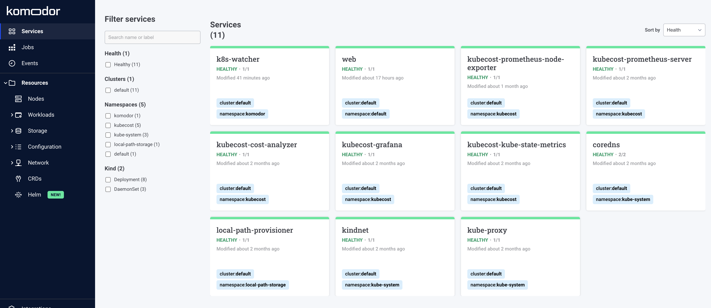
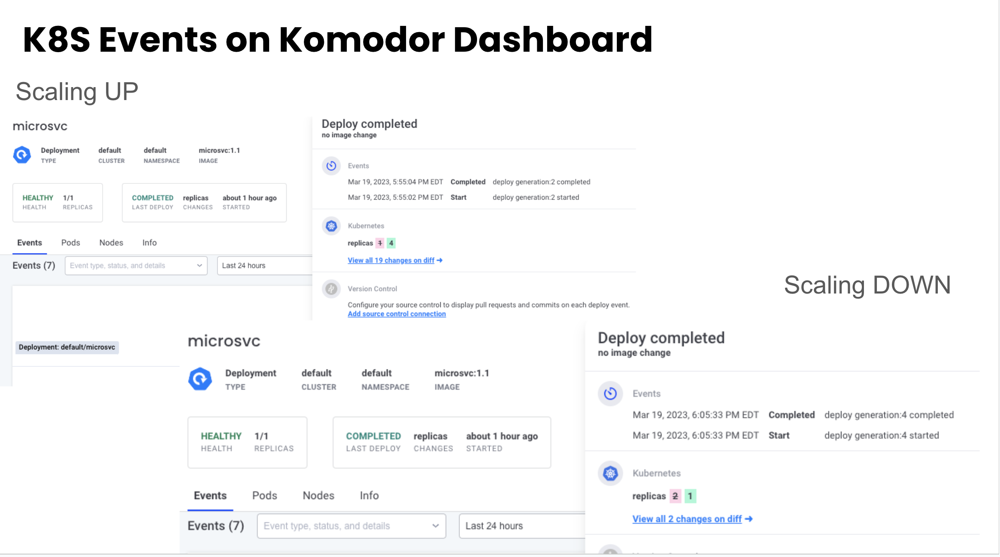

## Pre-requisites

Tools you need to have installed on your local machine before preceeding:

- Kind v1.25.3 using `brew install kind`
- kubectl 
- docker
- helm

## Deploy REST API in k8s cluster

Deploy a simple REST API deployment:

```
kubectl apply -f microsvc-deployment.yaml
```

To access the API, we can check the k8s service for that API and port-forward to access it via `localhost`:

```
kubectl get services
kubectl port-forward svc/microsvc 8080:8080
```

## Testing API locally

```
curl http://localhost:8080/employee | json_pp

You should get something like this:

[
   {
      "department " : "HR",
      "first" : "Susan",
      "id" : "101",
      "last" : "Matthew"
   },
   {
      "department " : "Finance",
      "first" : "Bill",
      "id" : "102",
      "last" : "Gates"
   },
   {
      "department " : "Engineering",
      "first" : "Prateek",
      "id" : "103",
      "last" : "Singh"
   },
   {
      "department " : "IT",
      "first" : "Rakesh",
      "id" : "104",
      "last" : "Singh"
   }
]
```

## Horizontal Pod Autoscaling
In Kubernetes, a HorizontalPodAutoscaler automatically updates a workload resource (such as a Deployment or StatefulSet), with the aim of automatically scaling the workload to match demand.

Horizontal scaling means that the response to increased load is to deploy more Pods. This is different from vertical scaling, which for Kubernetes would mean assigning more resources (for example: memory or CPU) to the Pods that are already running for the workload.

In this example, if there is a sustained spike in CPU utilization above a designated threshold, the HPA will increase the number of pods in the deployment to manage the new load to maintain smooth application function. If the load decreases, and the number of Pods is above the configured minimum, the HorizontalPodAutoscaler instructs the workload resource (the Deployment, StatefulSet, or other similar resource) to scale back down.

create the autoscaling by running before:

```
kubectl autoscale deployment microsvc --cpu-percent=30 --min=1 --max=4
```


## Challenges running k8s cluster locally using Kind

By default Kind cluster doesn't install `metrics-server`, so to resolove below error on HPA, we need to install `metrics-server` using helm. What is a k8s metrics-server? [metrics-server](https://github.com/kubernetes-sigs/metrics-server/) is a scalable, efficient source of container resource metrics for Kubernetes built-in autoscaling pipelines.

### Error
```
Warning  FailedGetResourceMetric  19m (x8 over 37m)      horizontal-pod-autoscaler  failed to get cpu utilization: unable to get metrics for resource cpu: unable to fetch metrics from resource metrics API: the server is currently unable to handle the request (get pods.metrics.k8s.io)
```

### Solution
```
helm repo add metrics-server https://kubernetes-sigs.github.io/metrics-server/
helm repo update
helm upgrade --install --set args={--kubelet-insecure-tls} metrics-server metrics-server/metrics-server --namespace kube-system
```

## Stress Test using Busybox

To apply load on the application, we can use `BusyBox` container which runs a shell script in while-true loop hitting the API endpoint `http://localhost:8080/employee` constantly on the pod, and this should increase the resource consumption on the pods.

Deploy a busybox container:

```
kubectl apply -f load-test.yaml
```

## Load/Stress Test using k6

[Grafana k6](https://k6.io/docs/get-started/running-k6/) is an open-source load testing tool that makes performance testing easy and productive for engineering teams. k6 is free, developer-centric, and extensible.

Using k6, you can test the reliability and performance of your systems and catch performance regressions and problems earlier. k6 will help you to build resilient and performant applications that scale.

k6 is developed by https://grafana.com/ and the community.

Install `k6` using brew: 
```
brew install k6
```

To run a load test, execute below cmd:

```
k6 run --vus 10 script.js
```

`script.js` has a simple javascript program to run load test using stages approach to ramp up and down using VU (Virtual Users)

Result output:

```

          /\      |‾‾| /‾‾/   /‾‾/   
     /\  /  \     |  |/  /   /  /    
    /  \/    \    |     (   /   ‾‾\  
   /          \   |  |\  \ |  (‾)  | 
  / __________ \  |__| \__\ \_____/ .io

  execution: local
     script: script.js
     output: -

  scenarios: (100.00%) 1 scenario, 30 max VUs, 2m50s max duration (incl. graceful stop):
           * default: Up to 30 looping VUs for 2m20s over 3 stages (gracefulRampDown: 30s, gracefulStop: 30s)


     ✓ status was 200

     checks.........................: 100.00% ✓ 2263      ✗ 0   
     data_received..................: 894 kB  6.4 kB/s
     data_sent......................: 199 kB  1.4 kB/s
     http_req_blocked...............: avg=34.89µs min=1µs    med=3µs    max=2.8ms   p(90)=4µs     p(95)=5µs    
     http_req_connecting............: avg=8.05µs  min=0s     med=0s     max=946µs   p(90)=0s      p(95)=0s     
     http_req_duration..............: avg=7.13ms  min=2.22ms med=5.59ms max=51.32ms p(90)=11.24ms p(95)=13.87ms
       { expected_response:true }...: avg=7.13ms  min=2.22ms med=5.59ms max=51.32ms p(90)=11.24ms p(95)=13.87ms
     http_req_failed................: 0.00%   ✓ 0         ✗ 2263
     http_req_receiving.............: avg=30.06µs min=10µs   med=26µs   max=2.29ms  p(90)=42µs    p(95)=47µs   
     http_req_sending...............: avg=13.53µs min=4µs    med=10µs   max=771µs   p(90)=18µs    p(95)=25µs   
     http_req_tls_handshaking.......: avg=0s      min=0s     med=0s     max=0s      p(90)=0s      p(95)=0s     
     http_req_waiting...............: avg=7.08ms  min=2.2ms  med=5.55ms max=51.14ms p(90)=11.19ms p(95)=13.83ms
     http_reqs......................: 2263    16.137276/s
     iteration_duration.............: avg=1s      min=1s     med=1s     max=1.05s   p(90)=1.01s   p(95)=1.01s  
     iterations.....................: 2263    16.137276/s
     vus............................: 1       min=1       max=30
     vus_max........................: 30      min=30      max=30


running (2m20.2s), 00/30 VUs, 2263 complete and 0 interrupted iterations
```

## Check for events on k8s autoscaling

While the stress testing is in progress, we can inspect the status of HPA that we applied earlier `kubectl autoscale deployment microsvc --cpu-percent=30 --min=1 --max=4`. In this example, we set the autoscaling on `microsvc` deployment to have the cpu utilization limit to `30%`, min replica count `1`, and max replica count `4`. After a couple of minutes, the HPA begins to observe an increase in currecnt CPU utilization and auto scales up to manage the incoming load. It will create the maximum number of pods to maintain CPU below the `30%` threshold.

```
kubectl get hpa -w    #watch the horizontal pod autoscaling 

kubectl describe hpa  #see events of auto scaling
```

## Using Komodor for discovering events on k8s autoscaling

[Komodor](https://komodor.com/free/) can be easily integrated with your cluster. Once singing up for free, and with just a Helm command, you can have Komodor installed. Using Komodor dashboard to drill down into your k8s resources, finding out errors, and health checks, resource events, and more!




